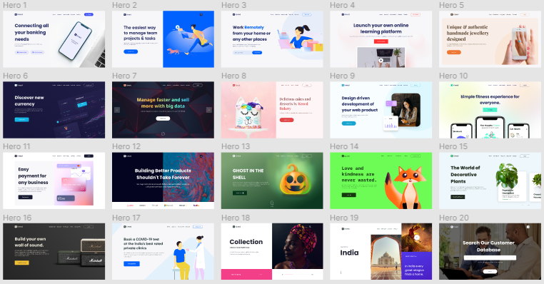

<h1 align="center">
  Landing Page
</h1>

  

 

  

## 💻 Projeto

O projetos desenvolvidos nesse diretorio são exclusivamente para praticar e aprender novas funcionalidades de ferramentas, sendo aplicadas na criação de landing page.
O layouts que serão encontrados nesse diretorio sem como base os modelos do repositorio do [Figma Template](https://www.figma.com/file/8beZh1CeewBHoLaJvJ7lHo/Heroes?node-id=1%3A13)

## 📄 Licença

Esse projeto está sob a licença MIT. Veja o arquivo [LICENSE](LICENSE.md) para mais detalhes.

