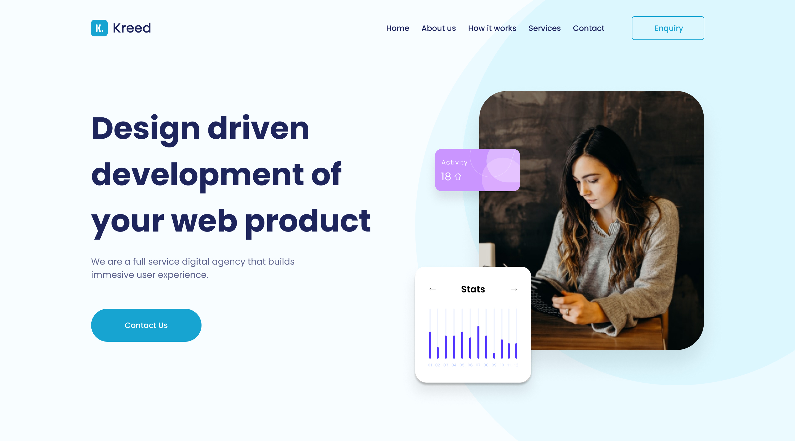

<h1 align="center">
  
</h1>

  

 

  

## ✨ Tecnologias

Esse projeto foi desenvolvido com as seguintes tecnologias:

- [React JS](https://pt-br.reactjs.org/)
- [Typescript](https://www.typescriptlang.org/)
- [ViteJS](https://vitejs.dev/)
- [Styled Components](https://styled-components.com/)

## 💻 Projeto

Aplicação se trata de uma Home Page, com o objetivo de estudo do "ViteJS" e algumas praticas utilizando do "Styled Components" além da aplicação dos conceitos de "Atomic Design".

A aplicação está disponivel para visualização [clique aqui](http://hero-frontend.arpdev.com.br/)

## 🚀 Como executar

- Clone o repositório
- Instale as dependências com `yarn install`
- Inicie o projeto em modo desenvolvedor com `yarn dev`

## 📄 Licença

Esse projeto está sob a licença MIT. Veja o arquivo [LICENSE](LICENSE.md) para mais detalhes.

